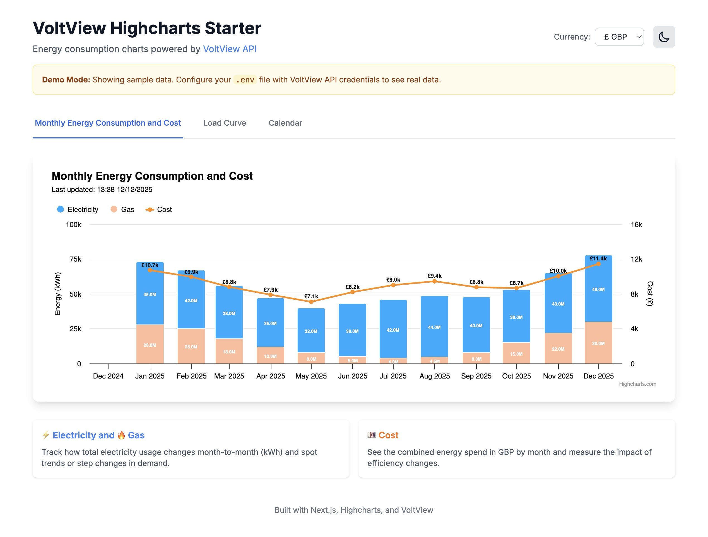

# VoltView Highcharts Starter

A starter kit for building energy consumption charts using the [VoltView API](https://docs.voltview.co.uk/api-reference/introduction) and [Highcharts](https://www.highcharts.com/).




## Features

- 📊 **Monthly Energy Consumption Chart** - Stacked column chart showing electricity and gas consumption
- 💷 **Cost Overlay** - Line chart overlay showing monthly energy costs
- 💰 **Multi-Currency Support** - Display costs in GBP (£) or USD ($)
- 🌓 **Dark/Light Theme** - Full theme support with system preference detection
- ⚡ **Interactive Legend** - Click to toggle energy types and see cost updates
- 🎨 **Fully Customisable** - Easy to modify colours, styles, and chart options

## Prerequisites

- **Node.js** 20.x or higher (check with `node --version`)
- **npm** 9.x or higher (comes with Node.js)
- **VoltView API credentials** (optional - demo data works without them)

## Quick Start

### 1. Clone the repository

```bash
git clone https://github.com/voltview/voltview-highcharts-starter.git
cd voltview-highcharts-starter
```

### 2. Install dependencies

```bash
npm install
```

### 3. Configure your API credentials

Copy the example environment file:

```bash
cp .env.example .env
```

Edit `.env` with your VoltView API key:

```env
VOLTVIEW_API_URL=https://api.voltview.co.uk
VOLTVIEW_API_KEY=your-api-key-here
```

> **Note:** Don't have a VoltView API key? The app will show demo data until you configure it. Sign up at [voltview.co.uk](https://app.voltview.co.uk) to get your API key.

### 4. Start the development server

```bash
npm run dev
```

Open [http://localhost:3000](http://localhost:3000) to see the chart.

## Build your first chart (copy-paste guide)

You can get a chart running in **two copies**:
1. In this starter app (for reference)
2. In your own app (by copying the minimal pieces)

### A. Monthly Energy Consumption & Cost

1. Start the dev server: `npm run dev`
2. Visit:
   - `/` → tab \"Monthly Energy Consumption and Cost\" (full demo)
   - `/examples/monthly-energy` → minimal example page
3. To copy into your app:
   - Copy `components/charts/MonthlyEnergyChart.tsx`
   - Copy the helpers `getMonthlyConsumption` and `getMonthlyCosts` from `lib/api.ts`
   - Call those helpers on your backend (Node/Next.js) and pass the results into the chart.

### B. Load Curve

1. With the dev server running, visit:
   - `/` → tab "Load Curve" (interactive demo with controls)
   - `/examples/load-curve` → minimal example page
2. To copy into your app:
   - Copy `components/charts/LoadCurveChart.tsx`
   - Copy the helper `getLoadCurveData` from `lib/api.ts`
   - Call it from your backend, pick the array that matches your summaryLevel (e.g. `data.daysOfWeek`), and pass it into the chart.

### C. Calendar Chart (Daily Patterns)

1. With the dev server running, visit:
   - `/` → tab "Calendar" (interactive demo with top-day highlighting)
   - `/examples/calendar` → minimal example page
2. To copy into your app:
   - Copy `components/charts/CalendarChart.tsx`
   - Copy the helper `getHourlyConsumption` from `lib/api.ts`
   - Optionally copy the `CalendarChartData` type from `types/index.ts`
   - Call `getHourlyConsumption` on your backend for a given date range (granularity=hour, unit=kWh), transform it into `CalendarChartData`, and pass it into the chart.

## Project Structure

```
voltview-highcharts-starter/
├── app/
│   ├── api/
│   │   ├── energy-data/
│   │   │   └── route.ts        # API route for MonthlyEnergyChart (monthly consumption + cost)
│   │   ├── load-curve/
│   │   │   └── route.ts        # API route for LoadCurveChart (load curve data)
│   │   └── calendar-data/
│   │       └── route.ts        # API route for CalendarChart (daily patterns calendar)
│   ├── globals.css           # Global styles
│   ├── layout.tsx            # Root layout with theme provider
│   └── page.tsx              # Main page with tabbed demo (Monthly + Load Curve)
├── components/
│   ├── charts/
│   │   ├── styles/
│   │   │   └── chart-theme.ts      # Chart theming for dark/light mode
│   │   ├── MonthlyEnergyChart.tsx  # Monthly Energy Consumption + Cost chart
│   │   ├── LoadCurveChart.tsx      # Load Curve (hourly pattern) chart
│   │   └── CalendarChart.tsx       # Calendar view of daily patterns vs max/avg/min
│   ├── ThemeProvider.tsx     # Theme context provider
│   └── ThemeToggle.tsx       # Dark/light mode toggle
├── lib/
│   └── api.ts                # VoltView API helpers (per-chart functions)
├── types/
│   └── index.ts              # TypeScript type definitions
└── README.md
```

### How this repo is organized

- `app/` – Demo Next.js app (routing, layout, API routes). You **don’t need to copy this whole folder** to use a chart.
- `components/charts/` – **Copy-pasteable chart components**. Import these into your own app.
- `lib/api.ts` – **Minimal VoltView API helper functions**. Each chart has a small set of helpers here.
- `types/` – Shared TypeScript types for VoltView responses used by the helpers and charts.

> **Goal of this repo:** Pick a chart → copy the React component from `components/charts/` → copy the matching helper(s) from `lib/api.ts` → wire to your own backend using the VoltView endpoints.

## Charts and their API calls

| Chart | Component | API helpers (in `lib/api.ts`) | VoltView endpoints |
|-------|-----------|-------------------------------|--------------------|
| Monthly Energy Consumption & Cost | `MonthlyEnergyChart.tsx` | `getMonthlyConsumption`, `getMonthlyCosts` | `GET /v1/sites/timeSeries`, `GET /v1/sites/cost` |
| Load Curve (Hourly Pattern) | `LoadCurveChart.tsx` | `getLoadCurveData` | `GET /v1/sites/loadCurve`, `GET /v1/sites/{siteId}/loadCurve` |
| Calendar Chart (Daily Patterns) | `CalendarChart.tsx` | `getHourlyConsumption` | `GET /v1/sites/timeSeries`, `GET /v1/sites/{siteId}/timeSeries` (with `granularity=hour&unit=kWh`) |

### Example: Monthly Energy Consumption & Cost

Minimal backend usage (Node/Next.js-style):

```ts
// lib/api.ts (copy these helpers into your own project if needed)
import { getMonthlyConsumption, getMonthlyCosts } from './lib/api';

const consumption = await getMonthlyConsumption('2025-01-01', '2025-12-31');
const cost = await getMonthlyCosts('2025-01-01', '2025-12-31');
```

Minimal React usage:

```tsx
import MonthlyEnergyChart from './components/charts/MonthlyEnergyChart';

export function MonthlyExample({ consumption, cost }) {
  return (
    <MonthlyEnergyChart
      consumptionData={consumption}
      costData={cost}
      currency="GBP"
    />
  );
}
```

### Example: Load Curve

Backend usage:

```ts
import { getLoadCurveData } from './lib/api';

const data = await getLoadCurveData({
  from: '2025-01-01',
  to: '2025-12-31',
  summaryLevel: 'dayOfWeek', // or 'day' | 'week' | 'month' | 'year'
});

// Pick the array matching summaryLevel to pass into the chart
const series = data.daysOfWeek ?? [];
```

React usage:

```tsx
import LoadCurveChart from './components/charts/LoadCurveChart';

export function LoadCurveExample({ series }) {
  return <LoadCurveChart data={series} />;
}
```

## Chart Customisation

### Currency

The chart supports both GBP (£) and USD ($). Use the currency selector in the top-right corner to switch between currencies. The currency formatting is automatically applied to:
- Y-axis labels
- Tooltips
- Data labels on the cost line

### Colours

Edit the series colors in `MonthlyEnergyChart.tsx`:

```typescript
series: [
  {
    name: 'Electricity',
    color: '#00AAFF',  // Blue
  },
  {
    name: 'Gas',
    color: '#FFBC99',  // Peach
  },
  {
    name: 'Cost',
    color: '#FF8C00',  // Orange
  },
]
```

### Theme

Modify the theme colors in `components/charts/styles/chart-theme.ts`:

```typescript
export const chartTheme = {
  light: {
    backgroundColor: '#FFFFFF',
    color: '#0A0A0A',
  },
  dark: {
    backgroundColor: '#111315',
    color: '#b8c5d6',
  },
};
```

## VoltView API

This starter uses the VoltView API v1 endpoints. All API calls are made **server-side** in the Next.js API route, ensuring your API key never reaches the browser.

### Authentication

The starter uses API key authentication:
- **Endpoint**: `POST /v1/requestToken`
- **Header**: `x-api-key: <your-api-key>`
- Returns a JWT token that is cached and reused until expiration

### Data Endpoints

| Endpoint | Description |
|----------|-------------|
| `GET /v1/sites/timeSeries` | Fetch consumption data for all sites |
| `GET /v1/sites/cost` | Fetch cost data for all sites |
| `GET /v1/sites/{siteId}/timeSeries` | Fetch consumption data for a specific site |
| `GET /v1/sites/{siteId}/cost` | Fetch cost data for a specific site |

For full API documentation, visit [docs.voltview.co.uk](https://docs.voltview.co.uk/api-reference/introduction).

### Available API Methods

```typescript
import { 
  getMonthlyConsumption, 
  getMonthlyCosts, 
  getSiteConsumption,
  getSiteCosts 
} from '@/lib/api';

// Fetch monthly consumption for all sites
const consumption = await getMonthlyConsumption('2025-01-01', '2025-12-31');

// Fetch monthly costs for all sites
const costs = await getMonthlyCosts('2025-01-01', '2025-12-31');

// Fetch consumption for a specific site
const siteData = await getSiteConsumption('site-id', '2025-01-01', '2025-12-31', 'month');

// Fetch costs for a specific site
const siteCosts = await getSiteCosts('site-id', '2025-01-01', '2025-12-31', 'month');
```

> **Note**: All API methods automatically handle authentication using your `VOLTVIEW_API_KEY` environment variable. The JWT token is cached and refreshed as needed.

## Adding More Charts

This starter is designed to be extended. Check out the VoltView API documentation to add more visualizations:

- **Load Curve Chart** - Hourly consumption patterns
- **Time Series Chart** - Flexible time-based analysis
- **Cost Breakdown** - Detailed cost analysis

## Troubleshooting

### Chart not displaying

- **Check browser console** for errors
- **Verify API credentials** - Check `.env` file has correct values
- **Check network tab** - Ensure API calls are succeeding (or falling back to demo data)

### "API not configured" error

This is expected if you haven't set up VoltView credentials. The app will automatically show demo data. To use real data:
1. Sign up at [app.voltview.co.uk](https://app.voltview.co.uk)
2. Get your API credentials
3. Add them to `.env` file
4. Restart the dev server

### Build errors

- **Node version mismatch** - Ensure you're using Node.js 20.x. Use `nvm use` if you have `.nvmrc`
- **TypeScript errors** - Run `npm run lint` to see detailed errors
- **Missing dependencies** - Delete `node_modules` and `package-lock.json`, then run `npm install`

### Chart looks broken in production

- **Check Highcharts license** - Ensure you have a valid Highcharts license for production use
- **Verify environment variables** - They must be set in your deployment platform
- **Check browser compatibility** - Highcharts requires modern browsers (Chrome, Firefox, Safari, Edge)

## Tech Stack

- [Next.js 14](https://nextjs.org/) - React framework
- [TypeScript](https://www.typescriptlang.org/) - Type safety
- [Highcharts](https://www.highcharts.com/) - Charting library
- [Tailwind CSS](https://tailwindcss.com/) - Styling
- [next-themes](https://github.com/pacocoursey/next-themes) - Theme management

## License

MIT License - feel free to use this starter for your own projects.

## Links

- [VoltView Website](https://voltview.co.uk)
- [VoltView API Docs](https://docs.voltview.co.uk/api-reference/introduction)
- [Highcharts Docs](https://www.highcharts.com/docs/index)
